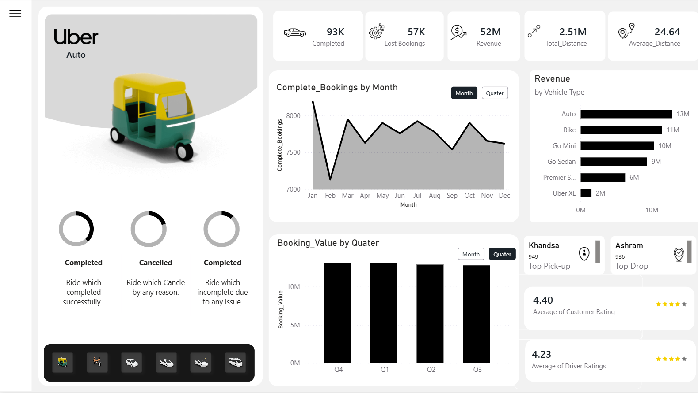
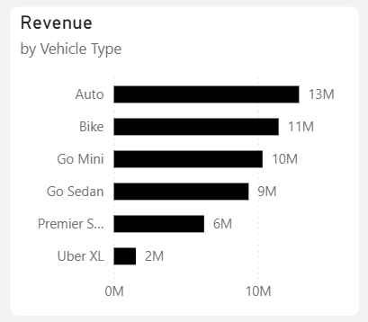
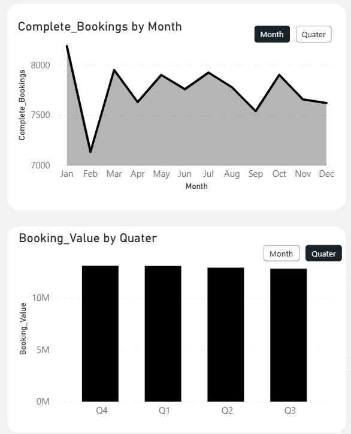
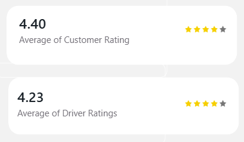

# 🚖 Uber Ride Analytics Dashboard

## 📊 Project Overview

The Uber Ride Analytics Dashboard is an interactive Business Intelligence project developed using Power BI to analyze ride booking performance, revenue trends, customer experience, and operational efficiency. The dashboard transforms raw ride data into actionable insights through interactive visualizations and KPI monitoring.

## 🛠️ Tools & Technologies

* Power BI
* Power Query
* DAX
* Data Visualization
* Business Intelligence Reporting

## 📈 Key Performance Indicators

* **93K+ Completed Rides**
* **57K+ Lost Bookings**
* **52M Total Revenue**
* **2.51M Total Distance Covered**
* **24.64 Average Trip Distance**
* **4.40 Customer Rating**
* **4.23 Driver Rating**

## 🖼️ Dashboard Preview

### Complete Dashboard Overview

### Revenue Analysis

### Booking Trends Analysis

### Customer & Driver Ratings

## 🔍 Key Insights

* Monitored monthly ride booking trends to identify demand patterns.
* Analyzed vehicle-wise revenue contribution across different ride categories.
* Evaluated quarterly booking values for business performance tracking.
* Identified top pickup and drop locations based on booking volume.
* Tracked customer and driver ratings to assess service quality.
* Measured operational KPIs including ride completion rates and trip distances.

## 🎯 Project Outcomes

This project demonstrates practical skills in:

* Data Cleaning and Transformation
* KPI Development
* DAX Calculations
* Interactive Dashboard Design
* Business Intelligence Reporting
* Data Storytelling and Visualization

## 📂 Repository Contents

* Uber_Dashboard.pbix
* Dashboard Screenshots
* Project Documentation

---

**Developed by Navnita Sharma**
